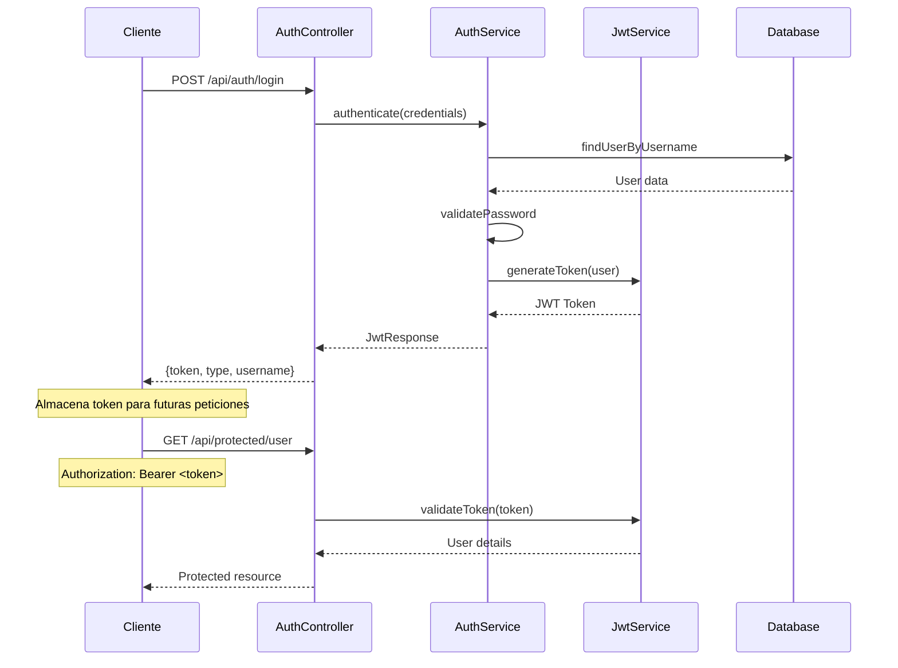

# JWT Spring Boot Demo - Tutorial Completo

<div align="center">


</div>

## 📋 Descripción del Proyecto

Este proyecto es una implementación completa de autenticación y autorización JWT (JSON Web Token) usando Spring Boot 3. Está diseñado para aprender los conceptos fundamentales de seguridad en aplicaciones web modernas.

### 🎯 Objetivos

- **Entender JWT**: Cómo funcionan los tokens, su estructura y ventajas
- **Spring Security**: Configuración moderna de seguridad con filtros personalizados
- **Arquitectura REST**: Diseño de APIs RESTful seguras y escalables
- **Inyección de Dependencias**: Principios de IoC (Inversión de Control) en Spring
- **JPA/Hibernate**: Persistencia de datos con relaciones muchos-a-muchos
- **Manejo de Excepciones**: Gestión centralizada de errores con ResponseEntityExceptionHandler
- **Buenas Prácticas**: Código limpio, documentación y estructura de proyecto profesional

## 🏗️ Arquitectura del Sistema

```
┌─────────────────┐    ┌─────────────────┐    ┌─────────────────┐
│   Frontend      │    │   Spring Boot   │    │   Base de Datos│
│   (Cliente)     │◄──►│   Application   │◄──►│   H2 Memory     │
└─────────────────┘    └─────────────────┘    └─────────────────┘
                              │
                              ▼
                    ┌─────────────────┐
                    │  JWT Token      │
                    │  Authentication │
                    └─────────────────┘
```

### 🔐 Flujo de Autenticación JWT



## 🚀 Instalación y Configuración

### Prerequisitos

- **Java 17 o superior**
- **Maven Wrapper** (incluido en el proyecto)
- **IDE** (IntelliJ IDEA, Eclipse, VS Code)
- **Git**

### 🔧 Paso a Paso

1. **Clonar el repositorio**
   ```bash
   git clone https://github.com/rcantore/spring-jwt-tutorial-completo.git
   cd spring-jwt-tutorial-completo
   ```

2. **Compilar el proyecto**
   ```bash
   ./mvnw clean compile
   ```

3. **Ejecutar tests**
   ```bash
   ./mvnw test
   ```

4. **Ejecutar la aplicación**
   ```bash
   ./mvnw spring-boot:run
   ```
   
   **Alternativa con JAR:**
   ```bash
   ./mvnw clean package
   java -jar target/jwt-demo-0.0.1-SNAPSHOT.jar
   ```

5. **Verificar que funciona**
   
   La aplicación estará disponible en: http://localhost:8080
   
   Deberías ver en los logs:
   ```
   Started JwtDemoApplication in X.XXX seconds
   ```

### 🔍 Consola de Base de Datos

Accede a la consola H2 en: http://localhost:8080/h2-console

**Configuración de conexión:**
- **Driver Class:** `org.h2.Driver`
- **JDBC URL:** `jdbc:h2:mem:testdb`
- **User Name:** `sa`
- **Password:** (dejar vacío)

## 🛠️ Estructura del Proyecto

```
src/
├── main/
│   ├── java/com/ejemplo/jwtdemo/
│   │   ├── JwtDemoApplication.java          # 🚀 Clase principal
│   │   ├── config/
│   │   │   ├── SecurityConfig.java          # 🔒 Configuración de seguridad
│   │   │   └── DataInitializer.java         # 📊 Datos iniciales
│   │   ├── controller/
│   │   │   ├── AuthController.java          # 🔑 Login/Registro
│   │   │   ├── UserController.java          # 👥 Gestión usuarios
│   │   │   ├── PublicController.java        # 🌐 Endpoints públicos
│   │   │   └── ProtectedController.java     # 🛡️ Endpoints protegidos
│   │   ├── dto/
│   │   │   ├── LoginRequest.java            # 📥 Request de login
│   │   │   ├── RegisterRequest.java         # 📥 Request de registro
│   │   │   ├── JwtResponse.java             # 📤 Response con token
│   │   │   ├── UserResponse.java            # 📤 Response de usuario
│   │   │   └── ErrorResponse.java           # ❌ Response de error
│   │   ├── entity/
│   │   │   ├── User.java                    # 👤 Entidad Usuario
│   │   │   └── Role.java                    # 🏷️ Entidad Rol
│   │   ├── exception/
│   │   │   ├── GlobalExceptionHandler.java  # 🚨 Manejo global errores
│   │   │   ├── UserNotFoundException.java   # ❌ Usuario no encontrado
│   │   │   ├── UserAlreadyExistsException.java # ❌ Usuario ya existe
│   │   │   └── InvalidCredentialsException.java # ❌ Credenciales inválidas
│   │   ├── filter/
│   │   │   └── JwtAuthenticationFilter.java # 🔍 Filtro JWT
│   │   ├── repository/
│   │   │   ├── UserRepository.java          # 💾 Repositorio usuarios
│   │   │   └── RoleRepository.java          # 💾 Repositorio roles
│   │   ├── service/
│   │   │   ├── AuthService.java             # 🔐 Lógica autenticación
│   │   │   ├── JwtService.java              # 🎫 Gestión tokens JWT
│   │   │   ├── CustomUserDetailsService.java # 👤 Carga detalles usuario
│   │   │   └── UserDetailsImpl.java         # 📋 Implementación UserDetails
│   │   └── util/                            # 🛠️ Utilidades (futuro)
│   └── resources/
│       └── application.properties           # ⚙️ Configuración
└── test/                                    # 🧪 Tests unitarios
    └── java/com/ejemplo/jwtdemo/
```

## 📚 Conceptos Técnicos Explicados

### 🎫 ¿Qué es JWT?

**JWT (JSON Web Token)** es un estándar abierto que define una forma compacta y segura de transmitir información entre partes como un objeto JSON.

**Estructura de un JWT:**
```
eyJhbGciOiJIUzI1NiIsInR5cCI6IkpXVCJ9.eyJzdWIiOiJhZG1pbiIsImlhdCI6MTcwMzI1NjAwMCwiZXhwIjoxNzAzMzQyNDAwfQ.signature
    ↑                                        ↑                                                                           ↑
 Header                                   Payload                                                                   Signature
```

**Ventajas de JWT:**
- ✅ **Stateless**: No requiere almacenamiento en servidor
- ✅ **Escalable**: Funciona bien en arquitecturas distribuidas
- ✅ **Portable**: Funciona entre diferentes dominios y servicios
- ✅ **Seguro**: Firmado digitalmente y opcionalmente encriptado

### 🔒 Spring Security con JWT

**Flujo de Seguridad:**

1. **JwtAuthenticationFilter**: Intercepta todas las peticiones
2. **Extrae el token**: Del header `Authorization: Bearer <token>`
3. **Valida el token**: Verifica firma y expiración
4. **Establece contexto**: Carga el usuario en SecurityContext
5. **Autoriza acceso**: Basado en roles y permisos

### 🏗️ Patrón de Arquitectura

**Separación de Responsabilidades:**

- **Controllers**: Manejo de peticiones HTTP y respuestas
- **Services**: Lógica de negocio y reglas de aplicación
- **Repositories**: Acceso a datos y persistencia
- **DTOs**: Objetos de transferencia de datos
- **Entities**: Representación de datos de base de datos
- **Filters**: Interceptación y procesamiento de peticiones

## 🔌 API Endpoints

### 🌐 Endpoints Públicos (Sin Autenticación)

#### 1. Información del Sistema
```http
GET /api/public/info
```

**Ejemplo de respuesta:**
```json
{
  "message": "JWT Demo API está funcionando correctamente",
  "version": "1.0.0",
  "timestamp": "2024-01-15T10:30:00Z"
}
```

**Ejemplo con curl:**
```bash
curl -X GET http://localhost:8080/api/public/info
```

### 🔑 Endpoints de Autenticación

#### 1. Iniciar Sesión
```http
POST /api/auth/login
Content-Type: application/json

{
  "username": "admin",
  "password": "admin123"
}
```

**Ejemplo de respuesta exitosa:**
```json
{
  "token": "eyJhbGciOiJIUzI1NiIsInR5cCI6IkpXVCJ9...",
  "type": "Bearer",
  "username": "admin",
  "email": "admin@ejemplo.com",
  "roles": ["ROLE_ADMIN", "ROLE_USER"]
}
```

**Ejemplo con curl:**
```bash
curl -X POST http://localhost:8080/api/auth/login \
  -H "Content-Type: application/json" \
  -d '{"username":"admin","password":"admin123"}'
```

#### 2. Registrar Usuario
```http
POST /api/auth/register
Content-Type: application/json

{
  "username": "nuevo_usuario",
  "email": "usuario@ejemplo.com",
  "password": "password123"
}
```

**Ejemplo de respuesta exitosa:**
```json
{
  "message": "Usuario registrado exitosamente",
  "username": "nuevo_usuario"
}
```

**Ejemplo con curl:**
```bash
curl -X POST http://localhost:8080/api/auth/register \
  -H "Content-Type: application/json" \
  -d '{"username":"nuevo_usuario","email":"usuario@ejemplo.com","password":"password123"}'
```

### 🛡️ Endpoints Protegidos (Requieren Autenticación)

#### 1. Información del Usuario Autenticado
```http
GET /api/protected/user
Authorization: Bearer <token>
```

**Ejemplo de respuesta:**
```json
{
  "message": "Acceso autorizado para usuario",
  "username": "admin",
  "authorities": ["ROLE_ADMIN", "ROLE_USER"]
}
```

**Ejemplo con curl:**
```bash
# Primero obtener el token
TOKEN=$(curl -s -X POST http://localhost:8080/api/auth/login \
  -H "Content-Type: application/json" \
  -d '{"username":"admin","password":"admin123"}' | \
  jq -r '.token')

# Usar el token para acceder al endpoint protegido
curl -X GET http://localhost:8080/api/protected/user \
  -H "Authorization: Bearer $TOKEN"
```

#### 2. Panel de Administración (Solo ADMIN)
```http
GET /api/protected/admin
Authorization: Bearer <token>
```

**Ejemplo de respuesta:**
```json
{
  "message": "Bienvenido al panel de administración",
  "username": "admin",
  "timestamp": "2024-01-15T10:30:00Z"
}
```

### 👥 Endpoints de Gestión de Usuarios (Solo ADMIN)

#### 1. Listar Todos los Usuarios
```http
GET /api/users
Authorization: Bearer <token>
```

**Ejemplo de respuesta:**
```json
[
  {
    "id": 1,
    "username": "admin",
    "email": "admin@ejemplo.com",
    "enabled": true,
    "roles": ["ROLE_ADMIN", "ROLE_USER"]
  },
  {
    "id": 2,
    "username": "user",
    "email": "user@ejemplo.com",
    "enabled": true,
    "roles": ["ROLE_USER"]
  }
]
```

#### 2. Obtener Usuario por ID
```http
GET /api/users/{id}
Authorization: Bearer <token>
```

#### 3. Eliminar Usuario
```http
DELETE /api/users/{id}
Authorization: Bearer <token>
```

## 🔑 Usuarios de Prueba Preconfigurados

El sistema incluye usuarios de prueba creados automáticamente:

| Usuario | Contraseña | Roles | Estado | Descripción |
|---------|------------|-------|--------|-------------|
| `admin` | `admin123` | ADMIN, USER | Activo | Administrador del sistema |
| `user` | `user123` | USER | Activo | Usuario básico |
| `juan` | `password123` | USER | Activo | Usuario de prueba adicional |
| `disabled` | `disabled123` | USER | Inactivo | Para probar cuentas deshabilitadas |

## 🧪 Ejemplos Completos con curl

### Flujo Completo de Autenticación

```bash
#!/bin/bash

echo "🚀 Probando API JWT Demo..."

# 1. Verificar que la API está funcionando
echo "📡 1. Verificando estado de la API..."
curl -s http://localhost:8080/api/public/info | jq '.'

echo -e "\n🔐 2. Iniciando sesión como administrador..."
# 2. Login como admin
LOGIN_RESPONSE=$(curl -s -X POST http://localhost:8080/api/auth/login \
  -H "Content-Type: application/json" \
  -d '{"username":"admin","password":"admin123"}')

echo $LOGIN_RESPONSE | jq '.'

# 3. Extraer token
TOKEN=$(echo $LOGIN_RESPONSE | jq -r '.token')

echo -e "\n🎫 Token obtenido: ${TOKEN:0:50}..."

echo -e "\n👤 3. Accediendo a endpoint protegido de usuario..."
# 4. Usar token para acceder a endpoint protegido
curl -s -X GET http://localhost:8080/api/protected/user \
  -H "Authorization: Bearer $TOKEN" | jq '.'

echo -e "\n👨‍💼 4. Accediendo a panel de administración..."
# 5. Acceder a panel de admin
curl -s -X GET http://localhost:8080/api/protected/admin \
  -H "Authorization: Bearer $TOKEN" | jq '.'

echo -e "\n👥 5. Listando todos los usuarios..."
# 6. Listar usuarios
curl -s -X GET http://localhost:8080/api/users \
  -H "Authorization: Bearer $TOKEN" | jq '.'

echo -e "\n✅ Flujo de prueba completado!"
```

### Registro de Nuevo Usuario

```bash
#!/bin/bash

echo "📝 Registrando nuevo usuario..."

REGISTER_RESPONSE=$(curl -s -X POST http://localhost:8080/api/auth/register \
  -H "Content-Type: application/json" \
  -d '{
    "username": "testuser",
    "email": "test@ejemplo.com",
    "password": "test123"
  }')

echo $REGISTER_RESPONSE | jq '.'

echo "🔐 Probando login con el nuevo usuario..."

LOGIN_RESPONSE=$(curl -s -X POST http://localhost:8080/api/auth/login \
  -H "Content-Type: application/json" \
  -d '{"username":"testuser","password":"test123"}')

echo $LOGIN_RESPONSE | jq '.'
```

### Manejo de Errores

```bash
#!/bin/bash

echo "❌ Probando manejo de errores..."

echo "1. Login con credenciales incorrectas:"
curl -s -X POST http://localhost:8080/api/auth/login \
  -H "Content-Type: application/json" \
  -d '{"username":"admin","password":"wrong"}' | jq '.'

echo -e "\n2. Acceso sin token:"
curl -s -X GET http://localhost:8080/api/protected/user | jq '.'

echo -e "\n3. Token inválido:"
curl -s -X GET http://localhost:8080/api/protected/user \
  -H "Authorization: Bearer invalid_token" | jq '.'

echo -e "\n4. Usuario sin permisos de admin intentando acceder a /admin:"
# Primero login como user normal
USER_TOKEN=$(curl -s -X POST http://localhost:8080/api/auth/login \
  -H "Content-Type: application/json" \
  -d '{"username":"user","password":"user123"}' | jq -r '.token')

curl -s -X GET http://localhost:8080/api/protected/admin \
  -H "Authorization: Bearer $USER_TOKEN" | jq '.'
```

## ⚙️ Configuración

### application.properties

```properties
# Puerto del servidor
server.port=8080

# Configuración JWT
app.jwt.secret=mySecretKey12345678901234567890123456789012345678901234567890
app.jwt.expiration=86400000  # 24 horas en milisegundos

# Base de datos H2 en memoria
spring.datasource.url=jdbc:h2:mem:testdb
spring.datasource.driverClassName=org.h2.Driver
spring.datasource.username=sa
spring.datasource.password=

# Consola H2
spring.h2.console.enabled=true
spring.h2.console.path=/h2-console

# JPA/Hibernate
spring.jpa.hibernate.ddl-auto=create-drop
spring.jpa.show-sql=true
spring.jpa.properties.hibernate.format_sql=true

# Logging
logging.level.org.springframework.security=DEBUG
logging.level.com.ejemplo.jwtdemo=DEBUG
```

### Personalización

Para cambiar configuraciones, puedes:

1. **Modificar application.properties**
2. **Variables de entorno:**
   ```bash
   export JWT_SECRET=tu_secreto_super_seguro
   export JWT_EXPIRATION=3600000  # 1 hora
   java -jar target/jwt-demo-0.0.1-SNAPSHOT.jar
   ```
3. **Argumentos de línea de comandos:**
   ```bash
   java -jar target/jwt-demo-0.0.1-SNAPSHOT.jar \
     --app.jwt.secret=mi_secreto \
     --server.port=9090
   ```

## 🚨 Manejo de Errores

La API incluye manejo completo de errores con respuestas consistentes:

### Errores de Autenticación

```json
{
  "error": "INVALID_CREDENTIALS",
  "message": "Credenciales inválidas",
  "timestamp": "2024-01-15T10:30:00Z",
  "path": "/api/auth/login"
}
```

### Errores de Autorización

```json
{
  "error": "ACCESS_DENIED",
  "message": "No tienes permisos para acceder a este recurso",
  "timestamp": "2024-01-15T10:30:00Z",
  "path": "/api/protected/admin"
}
```

### Errores de Validación

```json
{
  "error": "VALIDATION_ERROR",
  "message": "Datos de entrada inválidos",
  "details": [
    "El username es obligatorio",
    "El email debe tener formato válido"
  ],
  "timestamp": "2024-01-15T10:30:00Z",
  "path": "/api/auth/register"
}
```

## 🧪 Testing

### Ejecutar Tests

```bash
# Ejecutar todos los tests
./mvnw test

# Ejecutar tests específicos
./mvnw test -Dtest=AuthControllerTest

# Ejecutar con perfil de test
./mvnw test -Dspring.profiles.active=test
```

### Estructura de Tests

```
src/test/java/com/ejemplo/jwtdemo/
├── JwtDemoApplicationTests.java     # Test de contexto
├── controller/
│   ├── AuthControllerTest.java      # Tests de autenticación
│   └── UserControllerTest.java      # Tests de gestión usuarios
├── service/
│   ├── AuthServiceTest.java         # Tests de lógica auth
│   └── JwtServiceTest.java          # Tests de JWT
└── integration/
    └── SecurityIntegrationTest.java # Tests de integración
```

## 📊 Monitoreo y Logging

### Logs de la Aplicación

La aplicación genera logs detallados para debugging:

```
2024-01-15 10:30:00.123 INFO  [main] c.e.j.JwtDemoApplication : Starting JwtDemoApplication
2024-01-15 10:30:01.456 INFO  [main] c.e.j.c.DataInitializer  : 🚀 Iniciando poblado de datos iniciales...
2024-01-15 10:30:01.789 INFO  [main] c.e.j.c.DataInitializer  : ✅ Usuario administrador creado: admin / admin123
2024-01-15 10:30:02.012 INFO  [main] c.e.j.JwtDemoApplication : Started JwtDemoApplication in 2.5 seconds
```

### Logs de Seguridad

```
2024-01-15 10:30:15.123 DEBUG c.e.j.f.JwtAuthenticationFilter : Processing authentication for user: admin
2024-01-15 10:30:15.456 DEBUG c.e.j.s.JwtService            : Token generated for user: admin
2024-01-15 10:30:15.789 DEBUG c.e.j.s.JwtService            : Token validation successful for user: admin
```

## 🔧 Extensiones y Mejoras

### Funcionalidades Adicionales que Puedes Implementar

1. **Refresh Tokens**: Renovación automática de tokens
2. **Rate Limiting**: Limitar peticiones por usuario/IP
3. **Auditoría**: Registro de acciones de usuarios
4. **Perfiles de Usuario**: Información adicional de usuarios
5. **Roles Dinámicos**: Gestión de permisos granulares
6. **OAuth2 Integration**: Login con Google, GitHub, etc.
7. **Email Verification**: Verificación de email al registro
8. **Password Reset**: Recuperación de contraseña
9. **Two-Factor Auth**: Autenticación de dos factores
10. **API Versioning**: Versionado de la API

### Base de Datos de Producción

Para usar PostgreSQL en lugar de H2:

```xml
<!-- Agregar al pom.xml -->
<dependency>
    <groupId>org.postgresql</groupId>
    <artifactId>postgresql</artifactId>
    <scope>runtime</scope>
</dependency>
```

```properties
# application-prod.properties
spring.datasource.url=jdbc:postgresql://localhost:5432/jwtdemo
spring.datasource.username=jwtuser
spring.datasource.password=jwtpass
spring.jpa.hibernate.ddl-auto=update
spring.jpa.database-platform=org.hibernate.dialect.PostgreSQLDialect
```

## 🐛 Troubleshooting

### Problemas Comunes

1. **Puerto 8080 ocupado**
   ```bash
   # Cambiar puerto
   ./mvnw spring-boot:run -Dspring-boot.run.arguments=--server.port=8081
   ```

2. **Error de token expirado**
   ```
   Aumentar tiempo de expiración en application.properties:
   app.jwt.expiration=86400000  # 24 horas
   ```

3. **Problemas de CORS**
   ```java
   // Agregar a SecurityConfig.java
   @Bean
   public CorsConfigurationSource corsConfigurationSource() {
       CorsConfiguration configuration = new CorsConfiguration();
       configuration.setAllowedOriginPatterns(Arrays.asList("*"));
       configuration.setAllowedMethods(Arrays.asList("GET","POST","PUT","DELETE"));
       configuration.setAllowedHeaders(Arrays.asList("*"));
       configuration.setAllowCredentials(true);
       UrlBasedCorsConfigurationSource source = new UrlBasedCorsConfigurationSource();
       source.registerCorsConfiguration("/**", configuration);
       return source;
   }
   ```

4. **Base de datos no se inicializa**
   ```
   Verificar que DataInitializer se ejecute:
   logging.level.com.ejemplo.jwtdemo.config.DataInitializer=DEBUG
   ```

## 📚 Documentación del Proyecto

### Archivos de Referencia Técnica

- **[Componentes de Seguridad](COMPONENTES_SEGURIDAD.md)**: Arquitectura detallada del sistema de autenticación JWT, patrones de diseño aplicados, y flujos de seguridad completos.

- **[Testing de APIs REST](src/test/README_TESTS.md)**: Estrategia completa de testing con ejemplos prácticos, desde tests unitarios hasta integración, debugging de tests fallidos y mejores prácticas.

### Documentación Oficial

- [Spring Boot Documentation](https://docs.spring.io/spring-boot/docs/current/reference/htmlsingle/)
- [Spring Security Reference](https://docs.spring.io/spring-security/reference/)
- [JWT.io](https://jwt.io/) - Debugger y documentación JWT
- [JJWT Documentation](https://github.com/jwtk/jjwt)

### Tutoriales Recomendados

- [Baeldung Spring Security](https://www.baeldung.com/spring-security)
- [JWT Best Practices](https://auth0.com/blog/a-look-at-the-latest-draft-for-jwt-bcp/)
- [RESTful API Design](https://restfulapi.net/)

## 👨‍💻 Autor

**CebandoIdeas**
- Tutorial educativo para aprender Spring Boot Security con JWT
- Enfoque en buenas prácticas y código limpio
- Documentación completa en español

## 📄 Licencia

Este proyecto es material educativo y está disponible bajo licencia MIT para fines de aprendizaje.

---

<div align="center">

**¿Te gustó este tutorial?** ⭐ Deja una estrella en el repositorio

**¿Encontraste un bug?** 🐛 Abre un issue

**¿Quieres contribuir?** 🤝 Los pull requests son bienvenidos

</div>